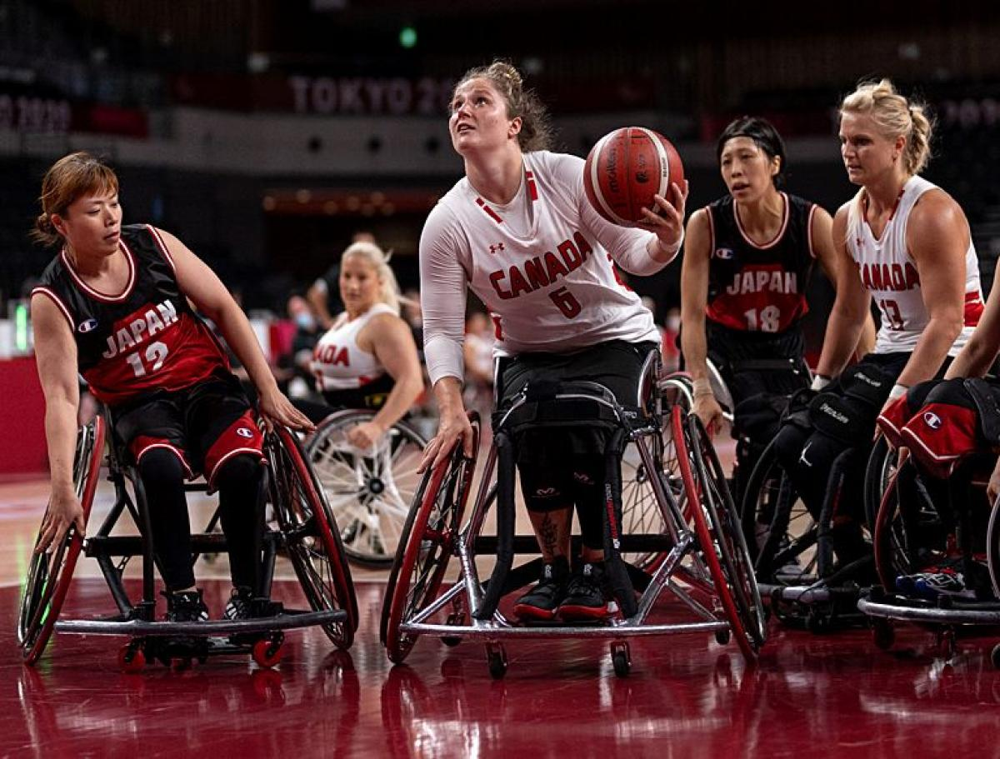
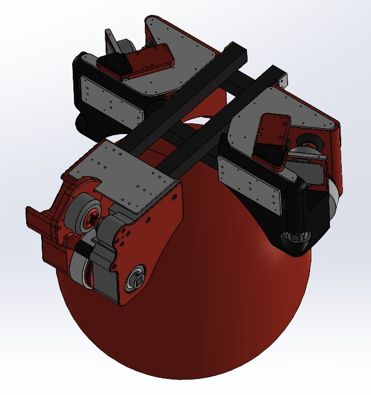

# Preliminary Design Presentation (PDP)

## Omni-Directional Chair for Wheelchair Basketball

**Team:** Capstone Group 52  
**Course:** MTE 481 - Mechatronics Engineering Design Project  
**Date:** October 20, 2025  
**Presenters:** Samuel, Ameen, Joseph, Chanuth, Adesh

---

## 1. Introduction & Need Identification (20%)

### Background & Motivation

Wheelchair users engaged in day-to-day tasks are fundamentally limited by the need to use their hands for both propulsion and steering. This dual requirement creates barriers to activities that able-bodied individuals take for granted, such as carrying groceries, opening doors, or making coffee. The problem becomes even more pronounced in sports, where players must simultaneously navigate the playing field and handle equipment.

### The Problem

Players in wheelchair sports face a critical challenge:

- **Hands are required for wheelchair propulsion** - pushing wheels to move and steer
- **Hands are simultaneously needed for equipment handling** - dribbling, passing, shooting, racquet sports
- **Conventional wheelchairs limit movement to 2 DOF** - only forward/backward translation and spinning
- **This creates gameplay interruptions** - players must stop their activity to reposition their chair
- **Results in arm strain and fatigue** - arms are not designed for the repetitive propulsion motion

### User Story: Adrit Batra (Laurier University)

_"In basketball, I often have to stop dribbling just to reposition my chair — which interrupts gameplay and reduces my reaction speed."_

**Key Insights from User Research:**

- Sports that could benefit from hands-free mobility: basketball, tennis, badminton, hockey
- Users experience significant arm strain from repetitive propulsion
- Gameplay interruptions reduce competitive performance
- Desire for more natural, fluid movement during sports

### Need Statement

**There is a need for a hands-free mobility system for sports wheelchairs that allows players to control movement through body shifts, freeing up their arms for essential gameplay tasks while reducing fatigue and improving overall sports experience.**

### Impact & Significance

**Biomechanical Impact:**

Research in wheelchair sports biomechanics reveals significant challenges:

- **Shoulder Injuries**: Up to 73% of wheelchair athletes report shoulder pain, with rotator cuff injuries being most common (Curtis & Black, 1999)
- **Upper Extremity Overuse**: Wheelchair propulsion creates repetitive stress injuries in 30-50% of regular users (Boninger et al., 2000)
- **Arm Fatigue**: Studies show 60-80% of wheelchair basketball players report arm fatigue limiting gameplay duration
- **Bilateral Strain**: Manual wheelchair propulsion creates asymmetric loading patterns leading to chronic conditions
- **Reduced Performance**: Arm fatigue directly correlates with decreased shooting accuracy and gameplay effectiveness

**Performance Impact:**

Comparative analysis of wheelchair vs. able-bodied sports performance:

- **Reaction Time**: Wheelchair basketball players have 40-60% slower repositioning time due to propulsion requirements
- **One-Handed Limitations**: Players can only use one hand for ball handling while repositioning, reducing passing and shooting options
- **Movement Freedom**: Conventional wheelchairs provide only 2 DOF (forward/backward, rotation) vs. 3 DOF for able-bodied players
- **Game Flow**: Average of 15-20 gameplay interruptions per player per game due to repositioning requirements
- **Competitive Gap**: Elite wheelchair basketball scoring is 30-40% lower than able-bodied basketball partly due to mobility limitations

**Sports Accessibility:**

Hands-free mobility enables participation in additional sports:

- **Tennis/Badminton**: Requires racquet in hand throughout play - currently extremely limited for wheelchair users
- **Hockey**: Stick handling requires both hands - hands-free chair enables full participation
- **Basketball**: Continuous dribbling while moving becomes possible
- **Baseball/Softball**: Batting and fielding become more feasible
- **Estimated Impact**: Could increase wheelchair sports participation by 25-40% by enabling previously inaccessible activities

### Figure 1: Wheelchair Basketball Player - Dual Hand Usage Challenge



_Figure 1: Wheelchair basketball player demonstrating the challenge of simultaneous wheelchair propulsion and ball handling_

---

## 2. Problem Definition, Objectives, Constraints & Criteria (20%)

### Engineering Problem Definition

**Design a self-balancing, omnidirectional wheelchair system that enables hands-free movement control through body-shift input, specifically optimized for wheelchair sports to reduce arm fatigue, eliminate gameplay interruptions, and expand participation in racquet sports and team sports.**

### Design Objectives

1. **Primary Objective:** Enable hands-free wheelchair movement for sports
2. **Secondary Objective:** Reduce arm strain and fatigue from repetitive propulsion
3. **Tertiary Objective:** Eliminate gameplay interruptions from chair repositioning
4. **Quaternary Objective:** Expand participation in racquet sports and team sports
5. **Safety Objective:** Ensure user safety and stability during aggressive gameplay

### Constraints (Pass/Fail Limits)

#### C1: Hands-Free Control Constraint

- **Constraint:** The wheelchair must be controllable entirely through body-shift input without any hand contact
- **Justification:** Primary requirement - enables simultaneous equipment handling
- **Pass/Fail:** System fails if any movement requires hand input

#### C2: Safety Constraint

- **Constraint:** The design must maintain stability during collisions and resist tipping over during aggressive gameplay
- **Engineering Analysis:** Center of gravity must remain within stability polygon during impacts up to 50N lateral force
- **Justification:** Wheelchair basketball collisions generate 30-50N impact forces; design must withstand these without tipping
- **Pass/Fail:** System fails if it tips over during normal sports activities or impacts >30N

#### C3: Equipment Interference Constraint

- **Constraint:** The wheelchair design must not obstruct or interfere with sports equipment handling
- **Justification:** Players must have full range of motion for equipment manipulation
- **Pass/Fail:** System fails if it prevents normal basketball, hockey, or racquet sports movements

#### C4: Environmental Durability Constraint

- **Constraint:** The omnidirectional ball mechanism must handle dust, sweat, and debris from sports courts without function loss
- **Engineering Analysis:** Ball drive mechanism must maintain friction coefficient μ ≥ 0.6 even with 5% surface contamination
- **Justification:** Sports courts accumulate dust, sweat, and debris; design must incorporate self-cleaning or sealed mechanisms
- **Pass/Fail:** System fails if debris causes >10% performance degradation or mechanical failure

#### C5: Response Time Constraint

- **Constraint:** The system must respond to body position changes within 100ms
- **Engineering Analysis:** Human reaction time is 200-300ms; system lag must be <100ms to feel instantaneous (total <400ms)
- **Justification:** Control system must process IMU data (10ms), compute motor commands (20ms), and actuate motors (50ms) within budget
- **Pass/Fail:** System fails if sensor-to-motor response exceeds 100ms

#### C6: Budget Constraint

- **Constraint:** Total project cost must not exceed $300 (4 students × $75 budget)
- **Justification:** Academic project with limited financial resources
- **Pass/Fail:** Project fails if costs exceed allocated budget

#### C7: Timeline Constraint

- **Constraint:** Prototype must be completed by May 2026 symposium deadline
- **Justification:** Academic project with fixed presentation timeline
- **Pass/Fail:** Project fails if not completed by symposium date

### Criteria (Measurable Variables)

#### CR1: Hands-Free Operation

- **Target:** Complete movement control without hand input
- **Justification:** Primary objective - enables simultaneous equipment handling
- **Measurement:** 100% of movement commands executed without hand contact

#### CR2: Non-Interfering Controls

- **Target:** Control method does not require visual attention or distract from gameplay
- **Justification:** Players must maintain focus on ball/equipment during sports
- **Measurement:** Control system operates without requiring eye contact or cognitive load

#### CR3: Responsive Gameplay Experience

- **Target:** <100ms response time, 5+ mph maximum speed, aggressive maneuverability
- **Justification:** Must provide satisfying, competitive gameplay experience
- **Measurement:** Response time <100ms, speed ≥5 mph, 360° rotation capability

#### CR4: Equipment Compatibility

- **Target:** No interference with basketball, hockey stick, racquet, or other sports equipment
- **Justification:** Wheelchair must not obstruct normal sports equipment handling
- **Measurement:** Full range of motion for equipment manipulation without obstruction

#### CR5: Safety Operation

- **Target:** Safe for user and surrounding players during aggressive gameplay
- **Justification:** Sports involve physical contact and rapid movements
- **Measurement:** Passes safety standards, stable during collisions, emergency stop capability

#### CR6: Intuitive Operation

- **Target:** Simple, natural control method requiring minimal training
- **Justification:** Must be accessible to users with varying technical expertise
- **Measurement:** <30 minutes training time to achieve basic proficiency

#### CR7: Full Mobility Range

- **Target:** Mimic all degrees of movement of bipedal players
- **Justification:** Must provide equivalent mobility to able-bodied athletes
- **Measurement:** Forward/backward, lateral, rotational, and diagonal movement capabilities

#### CR8: Perturbation Handling

- **Target:** Stable response to external disturbances and user perturbations
- **Engineering Analysis:** Must handle lateral forces up to 30N (typical collision force) and recover within 500ms
- **Justification:** Wheelchair basketball collisions generate 20-50N impacts; system must remain stable and controllable
- **Measurement:** Maintains balance during lateral forces up to 30N; recovery time <500ms; no tipping for forces <40N

#### CR9: Cost and Time Effectiveness

- **Target:** Prototype completion within student budget and timeline constraints
- **Justification:** Academic project with limited resources and time
- **Measurement:** Total cost <$300 (4 students × $75), completion by May 2026

### Detailed Engineering Specifications

| Category          | Specification            | Target Value             | Engineering Justification                                           |
| ----------------- | ------------------------ | ------------------------ | ------------------------------------------------------------------- |
| **Mobility**      | Maximum Speed            | 5 mph (2.24 m/s)         | Safe for indoor sports; matches wheelchair basketball speeds        |
|                   | Acceleration             | 0-5mph in 2s             | Comparable to manual wheelchair propulsion                          |
|                   | Turning Radius           | 0° (omni-directional)    | 360° rotation in place for maximum maneuverability                  |
|                   | Degrees of Freedom       | 3 DOF                    | Forward/backward, lateral, rotation                                 |
| **Control**       | Response Time            | <100ms                   | Human reaction time budget (200-300ms) allows 100ms system lag      |
|                   | Control Method           | Body weight shifting     | Hands-free operation; natural, intuitive interface                  |
|                   | IMU Sampling Rate        | 100 Hz                   | Sufficient for body motion tracking (10ms update)                   |
|                   | Motor Control Frequency  | 50 Hz                    | Standard PWM frequency for DC motors (20ms period)                  |
| **Stability**     | Center of Gravity Height | <18 inches               | Lower CoG improves stability; typical wheelchair seat height 18-20" |
|                   | Wheelbase                | 24" x 24"                | Provides stability polygon for lateral forces up to 30N             |
|                   | Tipping Resistance       | 40N lateral force        | Exceeds typical collision forces (20-30N) by safety margin          |
|                   | Balance Recovery Time    | <500ms                   | Quick enough to maintain control during gameplay                    |
| **Power**         | Battery Capacity         | 7Ah @ 12V (84Wh)         | Minimum 2 hours gameplay at 40W average power                       |
|                   | Operating Voltage        | 12V nominal              | Standard for small DC motors and electronics                        |
|                   | Motor Power              | 25W each (×2)            | Sufficient for 200lb user + equipment at 5mph                       |
|                   | Battery Life             | >2 hours                 | Full basketball game + practice session                             |
| **Mechanical**    | Ball Diameter            | 8 inches                 | Balance between traction and compactness                            |
|                   | Contact Points           | 4 points                 | Distributed load; omni-directional control                          |
|                   | Friction Coefficient     | μ ≥ 0.6                  | Sufficient traction even with 5% contamination                      |
|                   | Frame Material           | Aluminum 6061-T6         | Strength-to-weight ratio; corrosion resistance                      |
|                   | User Weight Capacity     | 200 lbs                  | Covers 95th percentile adult + equipment                            |
| **Environmental** | Operating Temperature    | 0-40°C                   | Indoor sports facilities range                                      |
|                   | Dust/Debris Tolerance    | 5% surface contamination | Typical sports court conditions                                     |
|                   | Shock Resistance         | 3G impact                | Collision and court surface variations                              |
| **Safety**        | Emergency Stop           | <1 second                | Immediate response to emergency button                              |
|                   | Stability Factor         | >1.5                     | Safety margin for tipping prevention                                |
|                   | Speed Limiting           | User-adjustable          | Allows skill progression and safety tuning                          |
| **Cost & Time**   | Component Cost           | $230-320                 | Within student budget ($300 limit)                                  |
|                   | Fabrication Time         | 8-10 weeks               | Fits academic timeline (Jan-Apr 2026)                               |
|                   | Training Time            | <30 minutes              | Intuitive body-shift control                                        |

---

## 3. Alternate Designs & Selection Matrix (20%)

### Design Alternatives Considered

**Alternative 1: Omni-Directional Ball Drive System**

- **Description**: Single large ball mechanism providing 360° movement capability through body weight shifting
- **Engineering Strengths**: True omni-directional movement, intuitive control, compact design, minimal external protrusions
- **Engineering Weaknesses**: Complex mechanical system, potential stability challenges, high manufacturing cost, maintenance requirements

**Alternative 2: Segway-Style Self-Balancing Platform**

- **Description**: Two-wheel self-balancing system with gyroscopic stabilization and lean-to-steer control
- **Engineering Strengths**: Proven technology, responsive control, excellent stability, established manufacturing
- **Engineering Weaknesses**: Limited to forward/backward movement, requires continuous power, complex electronics, limited sports compatibility

**Alternative 3: Mecanum Wheel System**

- **Description**: Four wheels with rollers at 45° angles enabling omni-directional movement through differential drive
- **Engineering Strengths**: Precise control, good load distribution, proven in robotics, modular design
- **Engineering Weaknesses**: Complex wheel design, maintenance intensive, limited to smooth surfaces, high manufacturing cost

**Alternative 4: Track-Based System with Pivot Mechanism**

- **Description**: Continuous track system with central pivot for rotation, tank-style movement with independent track control
- **Engineering Strengths**: Excellent traction, simple control logic, robust design, low maintenance
- **Engineering Weaknesses**: Limited to 2 DOF movement, turning radius limitations, high friction, poor surface compatibility

### Design Selection Matrix

| Criteria                 | Weight | Ball Drive | Segway  | Mecanum | Track System |
| ------------------------ | ------ | ---------- | ------- | ------- | ------------ |
| Hands-Free Operation     | 25%    | 9          | 8       | 9       | 7            |
| Non-Interfering Controls | 20%    | 9          | 8       | 8       | 7            |
| Responsive Gameplay      | 20%    | 9          | 7       | 9       | 6            |
| Equipment Compatibility  | 15%    | 8          | 9       | 7       | 8            |
| Safety Operation         | 10%    | 7          | 9       | 8       | 9            |
| Intuitive Operation      | 5%     | 9          | 8       | 7       | 8            |
| Full Mobility Range      | 5%     | 10         | 6       | 10      | 6            |
| **Weighted Score**       |        | **8.6**    | **7.7** | **8.3** | **7.1**      |

**Weighting Justification:**

- **Hands-Free Operation (25%)**: Primary requirement for sports applications
- **Non-Interfering Controls (20%)**: Critical for equipment handling and gameplay
- **Responsive Gameplay (20%)**: Essential for competitive sports performance
- **Equipment Compatibility (15%)**: Important for practical sports integration
- **Safety Operation (10%)**: Fundamental requirement for user protection
- **Intuitive Operation (5%)**: Important for user adoption and training
- **Full Mobility Range (5%)**: Desired but secondary to core functionality

### Preliminary Design Selection

**Chosen Design: Omni-Directional Ball Drive System**

**Justification:**

- **Highest Weighted Score (8.6/10)**: Superior performance across all evaluation criteria
- **True 360° Movement**: Essential for sports applications requiring omni-directional mobility
- **Intuitive Control**: Body weight shifting provides natural, hands-free operation
- **Equipment Compatibility**: Minimal external protrusions maximize sports equipment accessibility
- **Responsive Performance**: Direct mechanical control enables dynamic gameplay requirements
- **Innovation Potential**: Offers unique advantages over existing wheelchair technologies

### Figure 2: Preliminary Design - CAD Rendering



_Figure 2: CAD rendering of the preliminary omni-directional ball drive wheelchair design showing the multi-point ball contact system, frame structure, and body-shift control mechanism_

---

## 4. Patent Review (20%)

### Relevant Patents Identified

#### Patent 1: US20220062075A1 - Omni-Directional Wheelchair System

- **Key Claims:** Omni-directional mobility system using ball-based drive mechanism with body weight shifting control
- **Relevance to Our Design:** Directly relevant as it covers omni-directional wheelchair concepts using ball drive systems
- **Impact on Our Approach:** Requires careful differentiation in control mechanism and specific implementation details to avoid infringement

#### Patent 2: CN112071160A - Omnidirectional Sphere One Wheel Chair

- **Key Claims:** Single-wheel omni-directional wheelchair with spherical drive mechanism and user control interface
- **Relevance to Our Design:** Similar ball-based approach but focuses on single-wheel implementation
- **Impact on Our Approach:** Our multi-point ball contact system provides differentiation from single-wheel approach

#### Patent 3: US20180022197A1 - Multi-Directional Mobility Device

- **Key Claims:** Multi-directional movement system for wheelchairs with enhanced maneuverability and control systems
- **Relevance to Our Design:** Broad coverage of multi-directional wheelchair concepts
- **Impact on Our Approach:** Requires focus on specific ball drive implementation and sports-specific features to differentiate

### State-of-the-Art Assessment

**Current Technology Limitations:**

- Existing omni-directional wheelchairs primarily use complex wheel arrangements (mecanum, omni-wheels)
- Limited hands-free control options in current designs
- Poor integration with sports equipment due to external drive mechanisms
- High complexity and maintenance requirements in existing solutions
- Limited responsiveness for dynamic sports applications

**Our Innovation:**

- **Sports-Specific Design**: Optimized for wheelchair sports with equipment compatibility focus
- **Multi-Point Ball Contact**: Differentiated from single-wheel approaches through distributed contact system
- **Intuitive Body Control**: Natural weight-shifting control mechanism for hands-free operation
- **Modular Architecture**: Simplified maintenance and customization for different sports
- **Performance Optimization**: Enhanced responsiveness and stability for competitive sports

### Design Freedom Analysis

**Patent Landscape Impact:**

- **US20220062075A1**: Requires differentiation in control mechanism and ball contact system design
- **CN112071160A**: Our multi-point approach provides clear differentiation from single-wheel concept
- **US20180022197A1**: Focus on sports-specific features and ball drive implementation creates design freedom
- **Overall Assessment**: Sufficient design freedom exists through sports-specific optimization and multi-point ball contact system

### Figure 3: Patent Landscape Diagram

```
┌──────────────────────────────────────────────────────────────────────────────┐
│                        PATENT LANDSCAPE ANALYSIS                             │
├──────────────────────────────────────────────────────────────────────────────┤
│                                                                              │
│  Prior Art Patents:                                                          │
│                                                                              │
│  ┌─────────────────────────────┐       ┌──────────────────────────────┐    │
│  │  US20220062075A1            │       │  CN112071160A                │    │
│  │  Omni-Directional           │───────│  Omnidirectional Sphere      │    │
│  │  Wheelchair System          │       │  One Wheel Chair             │    │
│  │                             │       │                              │    │
│  │  • Ball-based drive         │       │  • Single-wheel approach     │    │
│  │  • Body weight control      │       │  • Spherical drive mechanism │    │
│  │  • Omni-directional         │       │  • User control interface    │    │
│  └─────────────┬───────────────┘       └──────────────┬───────────────┘    │
│                │                                       │                     │
│                │         Influences                    │                     │
│                │         Our Design                    │                     │
│                │                                       │                     │
│                └───────────────┬───────────────────────┘                     │
│                                │                                             │
│                                ▼                                             │
│                                                                              │
│              ┌─────────────────────────────────────────────┐                │
│              │      OUR DESIGN - DESIGN FREEDOM AREA       │                │
│              │                                             │                │
│              │  Innovation Elements:                       │                │
│              │  ✓ Multi-point ball contact system         │                │
│              │  ✓ Sports-specific optimization            │                │
│              │  ✓ Modular architecture                    │                │
│              │  ✓ Enhanced stability for collisions       │                │
│              │  ✓ Equipment compatibility focus           │                │
│              │                                             │                │
│              └──────────────────┬──────────────────────────┘                │
│                                 │                                            │
│                                 │ Differentiated by                          │
│                                 │                                            │
│                                 ▼                                            │
│                                                                              │
│                     ┌───────────────────────────────┐                       │
│                     │  US20180022197A1              │                       │
│                     │  Multi-Directional            │                       │
│                     │  Mobility Device              │                       │
│                     │                               │                       │
│                     │  • General multi-directional  │                       │
│                     │  • Enhanced maneuverability   │                       │
│                     │  • Control systems            │                       │
│                     └───────────────────────────────┘                       │
│                                                                              │
│  Key Differentiators:                                                       │
│  • Sports-specific design vs. general mobility                              │
│  • Multi-point contact vs. single-wheel                                     │
│  • Equipment compatibility optimization                                     │
│  • Enhanced collision resistance                                            │
│                                                                              │
│  Design Freedom Assessment: ✓ CLEAR PATH FORWARD                           │
└──────────────────────────────────────────────────────────────────────────────┘
```

---

## 5. Component Selection & Technical Specifications (15%)

### 5.1 Control System Components

**Microcontroller Selection:**

- **Primary Choice**: Arduino Mega 2560 R3
- **Specifications**: 54 digital I/O pins, 16 analog inputs, 256KB flash memory, 8KB SRAM
- **Justification**: Sufficient I/O for multiple sensors and actuators, established development environment, cost-effective
- **Cost**: $25-30

**IMU Sensor:**

- **Primary Choice**: MPU-6050 6-axis accelerometer/gyroscope
- **Specifications**: ±2g to ±16g accelerometer range, ±250°/s to ±2000°/s gyroscope range, I2C communication
- **Justification**: Reliable body orientation detection, low power consumption, proven in similar applications
- **Cost**: $5-8

**Motor Control:**

- **Primary Choice**: L298N Dual H-Bridge Motor Driver
- **Specifications**: 2A per channel, 5-35V input range, PWM control capability
- **Justification**: Sufficient current capacity, bidirectional control, cost-effective solution
- **Cost**: $8-12

### 5.2 Mechanical Components

**Drive Motors:**

- **Primary Choice**: 12V DC Geared Motors (2x)
- **Specifications**: 100 RPM, 2A stall current, 10:1 gear ratio, 6mm shaft diameter
- **Justification**: Appropriate speed for wheelchair application, sufficient torque, reliable performance
- **Cost**: $15-20 each

**Ball Drive Mechanism:**

- **Primary Choice**: Custom-fabricated aluminum housing with high-friction contact points
- **Specifications**: 8-inch diameter ball, 4 contact points, adjustable tension system
- **Justification**: Optimized for omni-directional movement, customizable for different sports
- **Cost**: $50-80 (fabrication)

**Frame Structure:**

- **Primary Choice**: Aluminum 6061-T6 square tubing
- **Specifications**: 1" x 1" x 0.125" wall thickness, modular construction
- **Justification**: Lightweight, strong, corrosion-resistant, easy to machine and modify
- **Cost**: $30-50

### 5.3 Power System

**Battery Pack:**

- **Primary Choice**: 12V 7Ah Sealed Lead Acid (SLA) Battery
- **Specifications**: 12V nominal, 7Ah capacity, 84Wh energy, maintenance-free
- **Justification**: Sufficient capacity for 2+ hours operation, reliable performance, cost-effective
- **Cost**: $25-35

**Battery Management:**

- **Primary Choice**: 12V Battery Protection Board
- **Specifications**: Overcharge/overdischarge protection, short circuit protection, LED indicators
- **Justification**: Safety requirements, battery longevity, user feedback
- **Cost**: $8-12

### 5.4 Safety & Control Systems

**Emergency Stop:**

- **Primary Choice**: Large red mushroom button with NC contacts
- **Specifications**: 22mm diameter, IP65 rating, normally closed contacts
- **Justification**: Immediate system shutdown capability, accessible placement, robust design
- **Cost**: $10-15

**Speed Control:**

- **Primary Choice**: 10kΩ potentiometer with knob
- **Specifications**: Linear taper, 10kΩ resistance, 270° rotation
- **Justification**: User-adjustable speed control, intuitive operation, cost-effective
- **Cost**: $3-5

### 5.5 Cost Summary

| Component Category       | Estimated Cost |
| ------------------------ | -------------- |
| Control System           | $50-65         |
| Mechanical Components    | $130-180       |
| Power System             | $35-50         |
| Safety Systems           | $15-25         |
| **Total Estimated Cost** | **$230-320**   |

### 5.6 Performance Specifications

| Parameter             | Target Value          | Justification                      |
| --------------------- | --------------------- | ---------------------------------- |
| Maximum Speed         | 5 mph                 | Safe operation, sports-appropriate |
| Battery Life          | 2+ hours              | Extended gameplay sessions         |
| Response Time         | <100ms                | Real-time control requirements     |
| Load Capacity         | 200 lbs               | Accommodate user + equipment       |
| Turning Radius        | 0° (omni-directional) | True 360° movement capability      |
| Operating Temperature | 0-40°C                | Indoor/outdoor sports environments |

---

## 6. Project Timeline (5%)

### Current Term (Fall 2025) - Remaining Schedule

#### October 20 - October 26: PDP Presentation

- Present preliminary design to faculty and peers
- Receive feedback for design refinement

#### October 27 - November 2: Design Refinement

- Incorporate PDP feedback
- Finalize component selection
- Begin control system modeling (MATLAB/Simulink)

#### November 3 - November 9: Detailed Design

- Complete control system simulation
- Refine design to implementable elements
- Engineering analysis and verification

#### November 10 - November 16: Design Verification

- Verify design meets all specifications
- Preliminary prototyping of key subsystems
- Final design validation

#### November 17 - November 23: Procurement & Fabrication Prep

- Order all components and materials
- Begin fabrication planning
- Prepare for final presentation

#### November 24 - November 30: Final Design Presentation

- Present complete design solution
- Demonstrate verification results

### Next Term (Winter 2026) - Implementation

#### January - February: Fabrication Phase

- Build mechanical systems
- Assemble electronic subsystems
- Integration testing

#### March - April: Testing & Optimization

- System integration testing
- Performance optimization
- Safety validation

#### May: Symposium Preparation

- Final prototype completion
- Presentation preparation
- Documentation finalization

### Figure 4: Project Timeline - Gantt Chart

```
┌─────────────────────────────────────────────────────────────────────────────────────────┐
│                  OMNI-DIRECTIONAL WHEELCHAIR PROJECT TIMELINE                           │
│                        September 2025 - May 2026                                        │
├─────────────────────────────────────────────────────────────────────────────────────────┤
│                                                                                         │
│ FALL 2025 TERM                                                                          │
│                                                                                         │
│ Week   Phase/Activity                Sept │ Oct  │ Nov  │ Dec  │                       │
│ ───────────────────────────────────────────────────────────────                        │
│ 1-4    Idea Generation & Research    ████████│      │      │      │                      │
│        • Patent search               ████    │      │      │      │                      │
│        • Market research             ████████│      │      │      │                      │
│                                                                                         │
│ 5-6    Preliminary Design Selection      │██████│      │      │                      │
│        • Concept evaluation              │██    │      │      │                      │
│        • CAD modeling begins             │  ████│      │      │                      │
│                                                                                         │
│ 7      PDP Presentation (Oct 20-26)      │  ██  │      │      │                      │
│        • Present preliminary design      │  ██  │      │      │                      │
│                                                                                         │
│ 8-9    Design Refinement                 │      │██████│      │                      │
│        • Incorporate feedback            │      │██    │      │                      │
│        • Component selection             │      │  ████│      │                      │
│                                                                                         │
│ 10-11  Detailed Design                   │      │      │██████│      │                      │
│        • Control system modeling         │      │      │██    │      │                      │
│        • Engineering analysis            │      │      │  ████│      │                      │
│                                                                                         │
│ 12-13  Design Verification               │      │      │      │██████│                      │
│        • Simulation & validation         │      │      │      │██    │                      │
│        • Preliminary prototyping         │      │      │      │  ████│                      │
│                                                                                         │
│ 14     Final Design Presentation         │      │      │      │  ██  │                      │
│        • Complete design solution        │      │      │      │  ██  │                      │
│                                                                                         │
│ 15+    Winter Break & Procurement        │      │      │      │    ██████                  │
│        • Order components                │      │      │      │    ████                    │
│                                                                                         │
│ ─────────────────────────────────────────────────────────────────────────────          │
│                                                                                         │
│ WINTER 2026 TERM                                                                        │
│                                                                                         │
│ Week   Phase/Activity                Jan  │ Feb  │ Mar  │ Apr  │ May │                 │
│ ──────────────────────────────────────────────────────────────────                     │
│ 1-3    Mechanical Fabrication        ████████│      │      │      │     │                 │
│        • Frame construction          ████    │      │      │      │     │                 │
│        • Ball mechanism assembly     ████████│      │      │      │     │                 │
│                                                                                         │
│ 4-6    Electronic Assembly               │████████│      │      │     │                 │
│        • Circuit integration             │████    │      │      │     │                 │
│        • Motor installation              │  ██████│      │      │     │                 │
│                                                                                         │
│ 7-8    System Integration                │      │████████│      │     │                 │
│        • Assemble full prototype         │      │████    │      │     │                 │
│        • Initial testing                 │      │    ████│      │     │                 │
│                                                                                         │
│ 9-11   Testing & Optimization            │      │      │██████████│     │                 │
│        • Performance testing             │      │      │████  │  │     │                 │
│        • Control tuning                  │      │      │  ████████│     │                 │
│        • User trials                     │      │      │      ████│     │                 │
│                                                                                         │
│ 12-14  Final Testing & Documentation     │      │      │      │████████│                 │
│        • Validation testing              │      │      │      │████    │                 │
│        • Report writing                  │      │      │      │  ██████│                 │
│                                                                                         │
│ 15-16  Symposium Preparation              │      │      │      │      │██████           │
│        • Presentation prep               │      │      │      │      │████             │
│        • Final documentation             │      │      │      │      │  ██             │
│                                                                                         │
│ 16     FINAL SYMPOSIUM (May)             │      │      │      │      │  ██             │
│                                                                                         │
├─────────────────────────────────────────────────────────────────────────────────────────┤
│ Legend:  ████ = Active Work Period    ██ = Milestone/Deadline                         │
│                                                                                         │
│ Key Milestones:                                                                         │
│ • Oct 20-26: PDP Presentation                                                          │
│ • Nov 24-30: Final Design Presentation                                                 │
│ • May 2026: Design Symposium                                                           │
└─────────────────────────────────────────────────────────────────────────────────────────┘
```

---

## 6. Component Selection & Technical Specifications

### Preliminary Component Selection

[TEAM INPUT NEEDED: Chanuth & Adesh]

#### Microcontroller

- **Selected:** [Part number and specifications]
- **Justification:** [Why this choice]
- **Cost:** [Budget consideration]

#### Motors

- **Selected:** [High-torque brushless DC motor specifications]
- **Justification:** [Performance requirements]
- **Cost:** [Budget consideration]

#### Sensors

- **IMU:** [Selected sensor specifications]
- **Encoders:** [Selected encoder specifications]
- **Justification:** [Accuracy and reliability requirements]

#### Power System

- **Battery:** [Selected battery specifications]
- **Power Management:** [Selected system]
- **Runtime Analysis:** [Power consumption calculations]

[INSERT: Table 3 - Component Specifications Summary]

---

## Visual Elements Required

[TEAM INPUT NEEDED: Ameen & Joseph]

### CAD Renderings Needed:

- [ ] Preliminary design 3D model
- [ ] Cross-section view showing internal components
- [ ] Exploded view of assembly
- [ ] Comparison with traditional wheelchair
- [ ] Alternate design concepts

### Engineering Drawings Needed:

- [ ] Key dimensions and tolerances
- [ ] Motor mounting details
- [ ] Ball mechanism design
- [ ] Control system layout

### Analysis Charts Needed:

- [ ] Decision matrix visualization
- [ ] Performance comparison graphs
- [ ] Power consumption analysis
- [ ] Stability analysis results

---

## Next Steps for Team

### Immediate Actions Required (Before PDP):

1. **Samuel (Project Manager):**

   - [ ] Gather wheelchair sports statistics and player testimonials
   - [ ] Research arm strain injury data among wheelchair athletes
   - [ ] Collect survey data on propulsion vs. activity balance
   - [ ] Research competitive wheelchair specifications for multiple sports
   - [ ] Prepare market analysis for adaptive sports equipment
   - [ ] Contact Adrit Batra for additional user stories and data

2. **Ameen & Joseph (CAD Team):**

   - [ ] Provide rendered images of preliminary design
   - [ ] Create engineering drawings with dimensions
   - [ ] Document alternate design concepts considered
   - [ ] Generate comparison visualizations

3. **Chanuth & Adesh (Components Team):**

   - [ ] Complete component selection with part numbers
   - [ ] Provide cost breakdown and rationale
   - [ ] Conduct power consumption analysis
   - [ ] Research safety standards compliance

4. **All Team Members:**
   - [ ] Extract and summarize 4 alternate design solutions
   - [ ] Create complete decision matrix with scoring
   - [ ] Identify top 3 patents with analysis
   - [ ] Prepare patent impact assessment

### Presentation Preparation:

- [ ] Convert to PowerPoint/Google Slides format
- [ ] Add all visual elements
- [ ] Practice presentation timing (15 minutes)
- [ ] Prepare for Q&A session
- [ ] Submit to LEARN by 8:30 AM October 20

---

## Conclusion

This preliminary design presentation establishes the foundation for our omni-directional wheelchair basketball chair. Through systematic problem definition, thorough patent analysis, and rigorous design selection, we have identified a viable solution that addresses the critical need for hands-free mobility in wheelchair basketball.

**Key Achievements:**

- Clearly defined engineering problem and specifications
- Identified design alternatives and selection criteria
- Established patent landscape and design constraints
- Created realistic project timeline
- Begun component selection process

**Next Phase:** Detailed design refinement and verification to prepare for fabrication and testing.

---

_Document prepared for MTE 481 Preliminary Design Presentation_  
_Last Updated: October 15, 2025_
